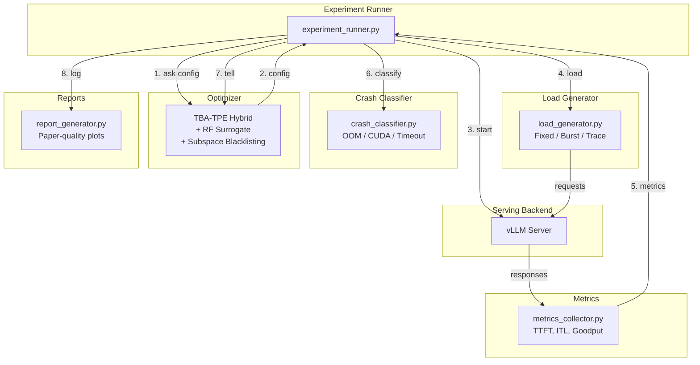
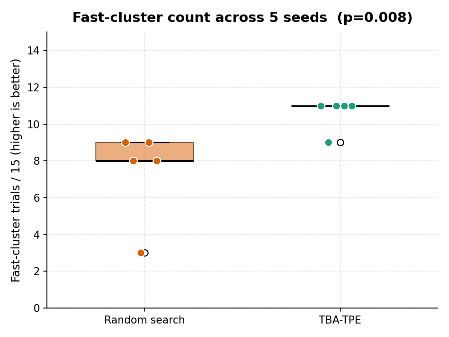
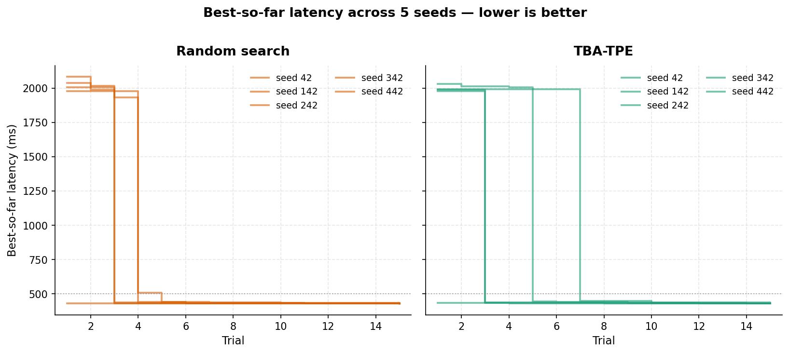
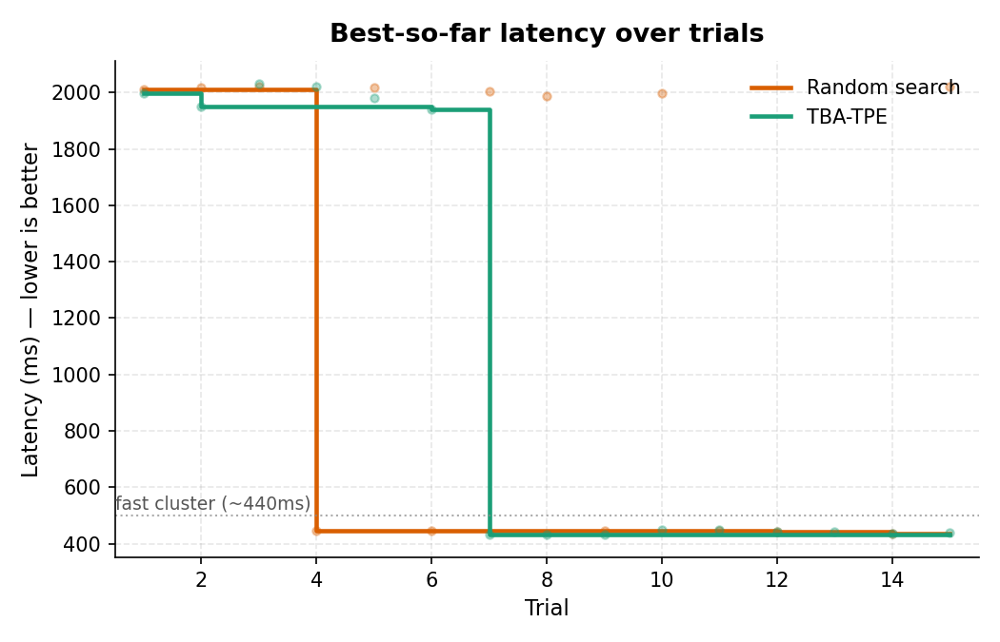
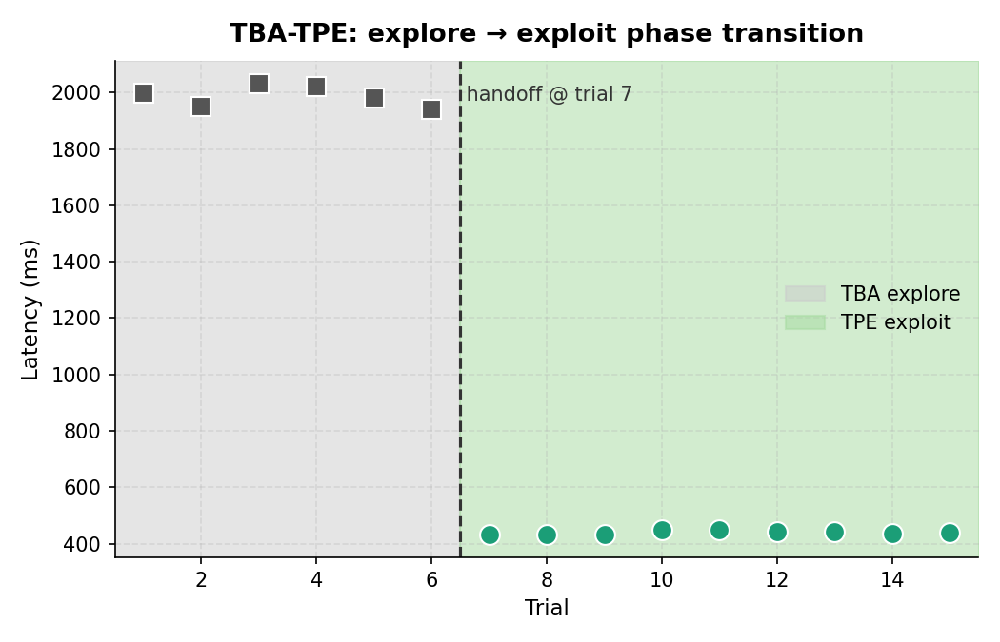
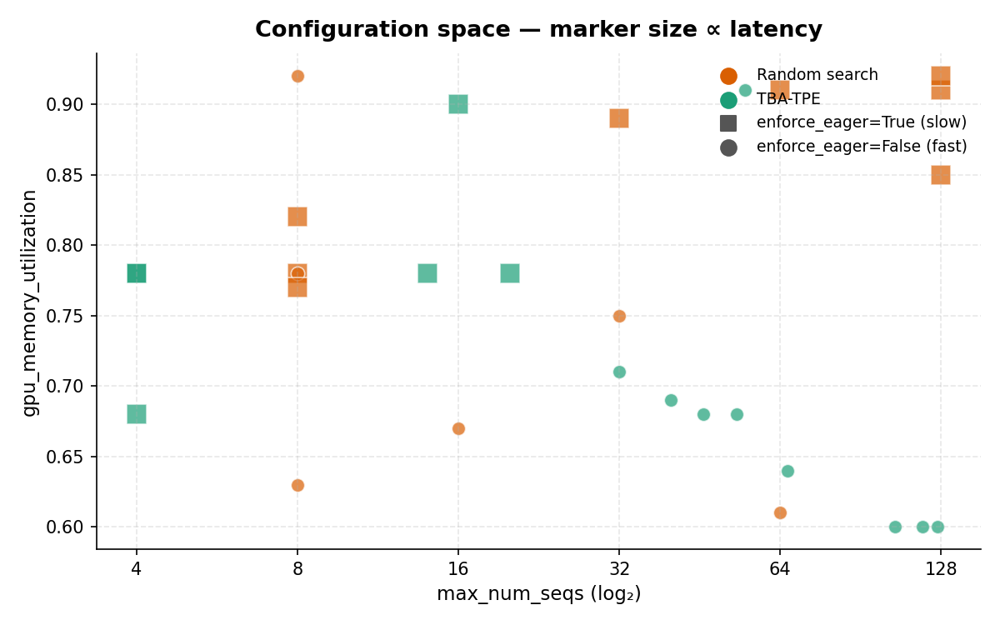
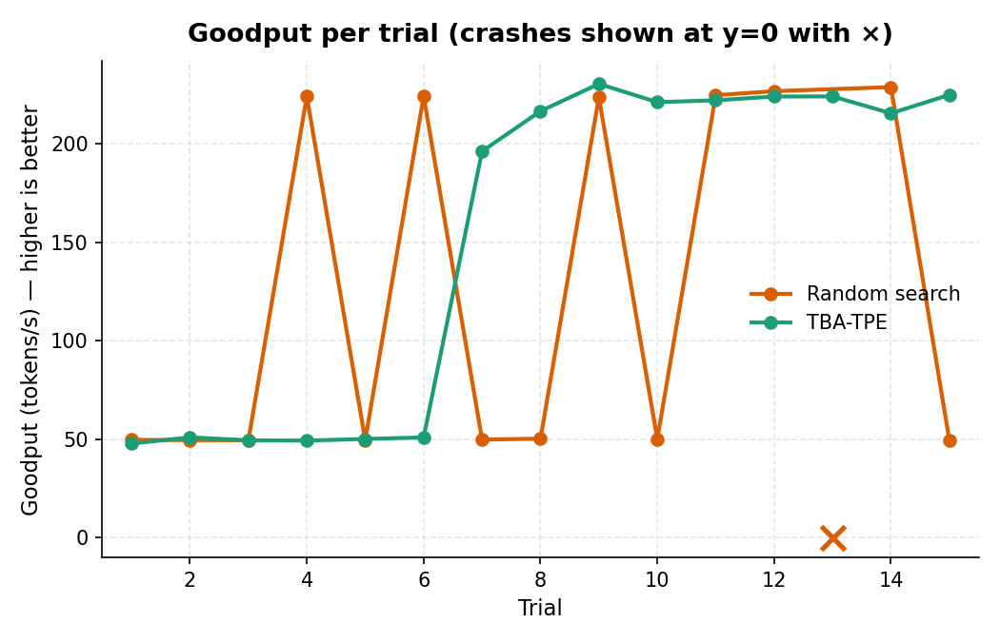

# SLO-Guard

**Crash-aware autotuning for LLM serving — optimizing goodput, not just throughput.**

SLO-Guard is a self-adaptive LLM serving "autopilot" that learns which serving configurations crash, violate SLOs, or succeed — and uses that knowledge to efficiently find optimal configs under hard latency and memory constraints.

## Key Features

- **Crash-aware optimization**: OOM/CUDA errors are data, not wasted trials. The feasibility model learns crash boundaries and avoids them.
- **Goodput-first**: Optimizes SLO-satisfying throughput (goodput), not raw throughput. A config with 1000 tok/s but 40% SLO violations has goodput = 600 tok/s.
- **TBA-TPE Hybrid**: Two-phase optimization — crash-aware simulated annealing maps the feasible region, then Optuna TPE exploits within it.
- **Real serving metrics**: TTFT, ITL, request latency distributions (p50/p95/p99), KV cache utilization.
- **Benchmark suite**: Standardized workloads (interactive, batch, bursty trace-driven) with paper-quality plots.

## Architecture



## Quickstart

```bash
# Install
pip install -e .

# Run a tuning experiment (requires vLLM + GPU)
sloguard tune \
    --model Qwen/Qwen2-1.5B \
    --optimizer tba-tpe \
    --budget 15 \
    --slo-ttft-p99 500 \
    --slo-itl-p99 100

# Generate reports from experiment logs
sloguard report --results-dir results/ --output figures/

# List available optimizers
sloguard list-optimizers
```

## GPU Detection

SLO-Guard auto-detects your GPU's VRAM and looks up a per-token KV-cache
size for known models, then sizes the search-space memory guard so that
`max_num_seqs * max_model_len` fits in the available KV budget on the
actual hardware.

Detection order:

1. `SLOGUARD_GPU_VRAM_GB` env var
2. PyTorch (`torch.cuda.get_device_properties(0).total_memory`) if installed
3. `nvidia-smi --query-gpu=memory.total`
4. Fallback to 40 GB (the A100 baseline)

Override knobs (useful on unsupported hardware or unlisted models):

| Env var | Purpose | Example |
|---|---|---|
| `SLOGUARD_GPU_VRAM_GB` | Force a specific VRAM size in GB | `24.0` (L4) |
| `SLOGUARD_KV_BYTES_PER_TOKEN` | KV cache size in GB per token | `0.000524` (Llama-3.1-8B) |
| `SLOGUARD_MODEL_FOOTPRINT_GB` | Reserve for weights + activations | `18.0` |

Adding a new model to the registry: edit `_MODEL_KV_GB_PER_TOKEN` and
`_MODEL_FOOTPRINT_GB` in `src/sloguard/gpu_profile.py`. Compute KV bytes as
`2 * num_layers * num_kv_heads * head_dim * dtype_bytes / 1e9` (the
leading `2` is for K and V separately).

## Configuration Space

SLO-Guard tunes 8 vLLM serving knobs. Knobs that mostly cause crashes
without meaningful performance variation (`block_size`, `swap_space`,
`cpu-offload`) have been removed from the search space.

| Knob | Type | Range / Choices | Notes |
|------|------|-----------------|-------|
| `quantization` | categorical | `["fp16"]` by default | Pass `quantization_choices=` to `build_serving_space()` to widen |
| `max_num_seqs` | integer (log) | 4 - 128 | |
| `max_num_batched_tokens` | integer (log) | 512 - 8192 | Auto-bumped to ≥ max(`max_num_seqs`, `max_model_len`) |
| `gpu_memory_utilization` | continuous | 0.60 - 0.95 | Lower bound is 0.60 to avoid wasting VRAM on dedicated GPUs |
| `max_model_len` | integer (log) | 512 - 4096 | Capped by KV-cache budget — see [GPU Detection](#gpu-detection) |
| `enforce_eager` | boolean | true / false | CUDA graphs vs eager |
| `enable_chunked_prefill` | boolean | true / false | Conditional: only active when `enforce_eager == False` (vLLM 0.19 returns 500s otherwise) |
| `enable_prefix_caching` | boolean | true / false | |

## Optimizers

| Method | Description |
|--------|-------------|
| `random` | Uniform random sampling (baseline) |
| `tpe` | Optuna TPE, cold start, no crash awareness (baseline) |
| `tba` | TBA — crash-aware SA + feasible-region TPE |
| `tba-tpe` | TBA-TPE Hybrid — SA exploration + warm-started Optuna TPE |
| `constrained-bo` | Constrained BO with GP surrogates (requires botorch) |

## Metrics

- **TTFT** (Time to First Token): p50, p95, p99
- **ITL** (Inter-Token Latency): p50, p95, p99
- **Request Latency**: p50, p95, p99
- **Throughput**: tokens/s, requests/s
- **Goodput**: SLO-satisfying throughput (tokens/s)
- **Crash Waste %**: fraction of budget wasted on crashes

## Project Structure

```
src/sloguard/
    __init__.py
    types.py              # Core data types (VariableDef, EvalResult, ServingTrialResult)
    config_space.py       # Search space + vLLM knob definitions
    server_manager.py     # vLLM server lifecycle
    load_generator.py     # Async HTTP load gen (fixed/burst/trace)
    metrics_collector.py  # TTFT/ITL/goodput computation
    crash_classifier.py   # Failure classification
    slo_contract.py       # SLO definitions + compliance
    trial_logger.py       # JSONL structured logging
    experiment_runner.py  # Main ask/tell benchmark loop
    report_generator.py   # Paper-quality matplotlib plots
    cli.py                # Click CLI entry point

    optimizer/
        base.py           # Ask/tell interface
        random_search.py  # Baseline: uniform random
        optuna_tpe.py     # Baseline: cold-start Optuna TPE
        tba_optimizer.py  # TBA: crash-aware SA + feasible TPE
        tba_tpe_hybrid.py # TBA-TPE: SA -> warm-start Optuna TPE
        constrained_bo.py # Baseline: GP-based constrained BO
        surrogate.py      # RF surrogate (OOB-gated)
        feasible_tpe.py   # KDE-based feasible-region sampler
        subspace_tracker.py   # Blacklisting (v3, combo-aware)
        feasibility_model.py  # Cross-GPU/model crash predictor
```

## Reproduce All Results

```bash
pip install -e ".[all]"
bash scripts/reproduce.sh
```

## Development

```bash
pip install -e ".[dev]"
make lint        # ruff
make typecheck   # pyright
make test        # unit tests
make smoke       # CPU-only integration test
```

## Results

Qwen2-1.5B on Colab A100 40GB, 15 trials per run, curl-based load
generator (5 requests/trial). Full writeup + limitations in
[`findings.md`](findings.md).

### Multi-seed comparison (5 seeds × 2 optimizers × 15 trials = 150 trials)

Aggregates over seeds 42, 142, 242, 342, 442. Numbers regenerate with
`python scripts/compute_multiseed_stats.py`.

| Metric | Random (n=5) | TBA-TPE (n=5) | Mann-Whitney p |
|---|---|---|---|
| Fast-cluster trials / 15 | 7.40 ± 2.51 | 10.60 ± 0.89 | **0.008** |
| Post-hit consistency | 0.539 ± 0.224 | 0.876 ± 0.123 | **0.010** |
| Best latency (ms) | 431.11 ± 1.74 | 431.57 ± 1.90 | 0.84 (tied) |
| Feasibility | 75 / 75 | 75 / 75 | — |
| Crashes | 0 | 0 | — |

**Best latency is statistically indistinguishable between optimizers
(Mann-Whitney two-sided p=0.84).** The win is in budget consistency:
TBA-TPE lands ~3 more trials in the fast cluster per run on average, and
its cross-seed variance on that metric is 2.8× tighter than Random's.

<p align="center">
  
  
</p>

Regenerate all four multi-seed plots:

```bash
python scripts/plot_comparison.py --multiseed results/multiseed/
```

### Single-seed pilot (for reference)

The initial single-seed run that motivated the multi-seed study. The
headline finding — bimodal latency driven by `enforce_eager` — held up
across all 10 runs.

| Metric | Random | TBA-TPE |
|---|---|---|
| Feasible trials | 14 / 15 | 15 / 15 |
| Crashes | 1 | 0 |
| Best goodput (tok/s) | ~224 | 230 |
| First fast-cluster hit | Trial 4 | Trial 7 |
| Fast-cluster trials after first hit | 5 / 12 | 9 / 9 |

<p align="center">
  
  
</p>
<p align="center">
  
  
</p>

```bash
python scripts/plot_comparison.py \
    --random  results/colab_random/random_run.jsonl \
    --tba-tpe results/tba_tpe/results.jsonl
```

Limitations are covered in [`findings.md`](findings.md): single model,
single GPU, search space dominated by one binary knob, no wall-clock
cost accounting.

## License

Apache 2.0

## Citation

If you use SLO-Guard in your research, please cite:

```bibtex
@software{sloguard2026,
  author = {Christian Lysen},
  title = {SLO-Guard: Crash-Aware Autotuning for LLM Serving},
  year = {2026},
  url = {https://github.com/Chrislysen/slo-guard}
}
```
