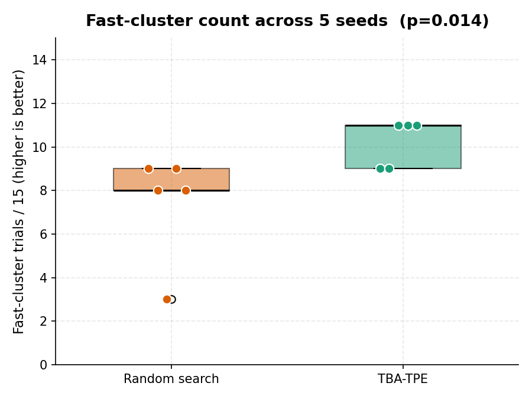
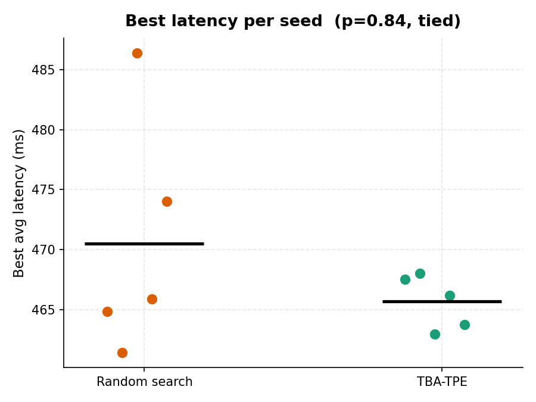

# SLO-Guard

Crash-aware autotuning for LLM serving — optimizing SLO-satisfying
throughput (goodput), not raw throughput, under hard latency and memory
constraints.

SLO-Guard treats OOM and CUDA errors as training data rather than wasted
trials. A two-phase optimizer (crash-aware simulated annealing followed
by warm-started Optuna TPE) learns the feasible region of vLLM's
configuration space and exploits within it. This repository contains the
full tuning harness, the published paired-seed benchmark data, and the
reproduction pipeline.

## Paper

- Christian Lysenstøen. *SLO-Guard: Crash-Aware Autotuning for LLM
  Serving.* 2026. (arXiv preprint — link pending moderation.)

```bibtex
@misc{sloguard2026,
  author    = {Christian Lysenstøen},
  title     = {SLO-Guard: Crash-Aware Autotuning for LLM Serving},
  year      = {2026},
  publisher = {arXiv},
  arxiv_id  = "TODO: fill after arXiv moderation clears",
  url       = {https://github.com/Chrislysen/slo-guard}
}
```

## Headline result

Qwen2-1.5B on Colab A100 40 GB, concurrent load-generator harness,
5 seeds × 2 optimizers × 15 trials = **150 trials**, zero crashes.

<p align="center">
  
  
</p>

| Metric | Random (n = 5) | TBA-TPE (n = 5) | Mann-Whitney *p* |
|---|---|---|---|
| Fast-cluster trials / 15 | 7.40 ± 2.51 | 10.20 ± 1.10 | **0.014** |
| Post-hit consistency | 0.539 ± 0.224 | 0.876 ± 0.123 | **0.010** |
| Best latency (ms) | 470.52 ± 10.00 | 465.69 ± 2.26 | 0.84 |
| Feasibility | 75 / 75 | 75 / 75 | — |
| Crashes | 0 | 0 | — |

Best-achieved latency is statistically tied on the mean; the method's
advantage is in budget consistency and in cross-seed variance on best
latency (**4.42× tighter** under concurrent load: 2.26 ms vs 10.00 ms).

## Quickstart

```bash
pip install -e .

# Run a tuning experiment (requires vLLM + GPU)
sloguard tune \
    --model Qwen/Qwen2-1.5B \
    --optimizer tba-tpe \
    --budget 15 \
    --slo-ttft-p99 500 \
    --slo-itl-p99 100

# Generate plots from experiment logs
sloguard report --results-dir results/ --output figures/
```

## What's in this repo

```
src/sloguard/
    experiment_runner.py    ask / tell orchestrator (eval lifecycle, utility)
    load_generator.py       concurrent async HTTP load gen (Semaphore-capped)
    metrics_collector.py    TTFT / ITL / goodput / KV-cache parsing
    crash_classifier.py     OOM / CUDA / timeout attribution
    config_space.py         hierarchical search space with conditional knobs
    gpu_profile.py          VRAM + per-model KV footprint detection
    slo_contract.py         SLO thresholds + goodput math
    trial_logger.py         fsync-durable JSONL
    optimizer/              random, optuna-tpe, tba, tba-tpe, constrained-bo
scripts/
    run_multiseed.py        resumable multi-seed paired-benchmark runner
    compute_multiseed_stats.py  Mann-Whitney + summary.json
    plot_comparison.py      single-seed and --multiseed figure generation
results/multiseed_concurrent/   published paired-benchmark data (this paper)
results/multiseed/              replication baseline (sequential harness)
figures/multiseed_concurrent/   paper figures
```

## Method

Two-phase ask/tell loop over a hierarchical mixed-variable search space.
Phase 1 is a crash-aware simulated annealing (TBA) that maps the
feasible region using an OOB-gated random-forest surrogate and a
subspace blacklister. Phase 2 warm-starts an Optuna TPE sampler with the
feasible trials from Phase 1 and exploits them. See Figure 3 of the
paper for the full pipeline.

## Configuration space

SLO-Guard tunes 8 vLLM serving knobs. Knobs that mostly cause crashes
without meaningful performance variation (`block_size`, `swap_space`,
`cpu-offload`) are excluded.

| Knob | Type | Range / Choices | Notes |
|---|---|---|---|
| `quantization` | categorical | `["fp16"]` by default | Pass `quantization_choices=` to `build_serving_space()` to widen |
| `max_num_seqs` | integer (log) | 4 – 128 | |
| `max_num_batched_tokens` | integer (log) | 512 – 8192 | Auto-bumped to ≥ max(`max_num_seqs`, `max_model_len`) |
| `gpu_memory_utilization` | continuous | 0.60 – 0.95 | Lower bound 0.60 avoids wasting VRAM on dedicated GPUs |
| `max_model_len` | integer (log) | 512 – 4096 | Capped by KV-cache budget — see [GPU detection](#gpu-detection) |
| `enforce_eager` | boolean | true / false | CUDA graphs vs eager |
| `enable_chunked_prefill` | boolean | true / false | Conditional: only active when `enforce_eager == False` (vLLM 0.19 returns 500s otherwise) |
| `enable_prefix_caching` | boolean | true / false | |

## Optimizers

| Method | Description |
|---|---|
| `random` | Uniform random sampling (baseline) |
| `tpe` | Optuna TPE, cold start, no crash awareness (baseline) |
| `tba` | Crash-aware SA with feasible-region TPE |
| `tba-tpe` | TBA-TPE Hybrid — SA exploration then warm-started Optuna TPE |
| `constrained-bo` | Constrained BO with GP surrogates (requires botorch) |

## Metrics

- **TTFT** — time to first token (p50 / p95 / p99)
- **ITL** — inter-token latency (p50 / p95 / p99)
- **Goodput** — SLO-satisfying throughput (tokens/sec)
- **Crash waste %** — fraction of budget lost to crashes

## Reproducing the paper's 150-trial concurrent-harness result

```bash
git checkout f26022f
pip install -e .
python scripts/run_multiseed.py \
    --output-dir results/multiseed_concurrent/ \
    --seeds 42 142 242 342 442 \
    --optimizers random tba-tpe \
    --budget 15 \
    --model Qwen/Qwen2-1.5B
```

Estimated runtime: ~4–5 hours on A100 40 GB. The runner is resumable via
JSONL replay if Colab disconnects — each pair's completed trials are
fed back into a fresh optimizer before new trials are issued.

After the run, regenerate the headline statistics and figures:

```bash
python scripts/compute_multiseed_stats.py \
    --results-dir results/multiseed_concurrent/ \
    --summary-out results/multiseed_concurrent/summary.json

python scripts/plot_comparison.py \
    --multiseed results/multiseed_concurrent/ \
    --output   figures/multiseed_concurrent/
```

## Harness replication: sequential vs concurrent

The paper reports only the concurrent-harness numbers. The sequential
harness (original Colab inline curl loop, pre-concurrency-fix) is
retained in `results/multiseed/` as a replication baseline. The two
harnesses are the **same optimizer matrix under different measurement
conditions**:

| Harness | Fast-cluster / 15 | Post-hit consistency | Best latency (ms) | Data |
|---|---|---|---|---|
| Concurrent (paper) | 7.40 ± 2.51 vs 10.20 ± 1.10 (*p*=0.014) | 0.539 ± 0.224 vs 0.876 ± 0.123 (*p*=0.010) | 470.52 ± 10.00 vs 465.69 ± 2.26 (*p*=0.84) | `results/multiseed_concurrent/` |
| Sequential (replication) | 7.40 ± 2.51 vs 10.60 ± 0.89 (*p*=0.008) | 0.539 ± 0.224 vs 0.876 ± 0.123 (*p*=0.010) | 431.11 ± 1.74 vs 431.57 ± 1.90 (*p*=0.84) | `results/multiseed/` |

Consistency findings replicate across both harnesses; the best-latency
variance advantage is only visible under concurrent load, where the
fast cluster has measurable per-config variation from contention and
scheduling. See [`findings.md`](findings.md) for the full discussion.

<p align="center">
  
  
</p>

<details>
<summary>Single-seed pilot (for reference)</summary>

The initial single-seed run that motivated the multi-seed study. The
bimodal-latency finding held up across all 10 runs.

| Metric | Random | TBA-TPE |
|---|---|---|
| Feasible trials | 14 / 15 | 15 / 15 |
| Crashes | 1 | 0 |
| Best goodput (tok/s) | ~224 | 230 |
| First fast-cluster hit | Trial 4 | Trial 7 |
| Fast-cluster trials after first hit | 5 / 12 | 9 / 9 |

<p align="center">
  
  
</p>

```bash
python scripts/plot_comparison.py \
    --random  results/colab_random/random_run.jsonl \
    --tba-tpe results/tba_tpe/results.jsonl
```

</details>

## Limitations

Results are for a single model (Qwen2-1.5B) on a single GPU (Colab A100
40 GB) with 5 seeds of 15 trials each. The search space is dominated by
one binary knob (`enforce_eager`), which narrows the optimization problem;
richer models or stronger knob-interaction problems may behave differently.
Full discussion in [`findings.md`](findings.md).

## GPU detection

SLO-Guard auto-detects GPU VRAM and looks up a per-token KV-cache size
for known models, then sizes the memory guard so `max_num_seqs *
max_model_len` fits the available KV budget.

Detection order:

1. `SLOGUARD_GPU_VRAM_GB` env var
2. PyTorch (`torch.cuda.get_device_properties(0).total_memory`) if installed
3. `nvidia-smi --query-gpu=memory.total`
4. Fallback to 40 GB (A100 baseline)

Overrides for unsupported hardware or unlisted models:

| Env var | Purpose | Example |
|---|---|---|
| `SLOGUARD_GPU_VRAM_GB` | Force a specific VRAM size in GB | `24.0` (L4) |
| `SLOGUARD_KV_BYTES_PER_TOKEN` | KV cache size in GB per token | `0.000524` (Llama-3.1-8B) |
| `SLOGUARD_MODEL_FOOTPRINT_GB` | Reserve for weights + activations | `18.0` |

To add a model to the registry: edit `_MODEL_KV_GB_PER_TOKEN` and
`_MODEL_FOOTPRINT_GB` in `src/sloguard/gpu_profile.py`. KV bytes per
token = `2 * num_layers * num_kv_heads * head_dim * dtype_bytes / 1e9`.

## Development

```bash
pip install -e ".[dev]"
make lint        # ruff
make typecheck   # pyright
make test        # unit tests
make smoke       # CPU-only integration test
```

## License

Apache 2.0.
